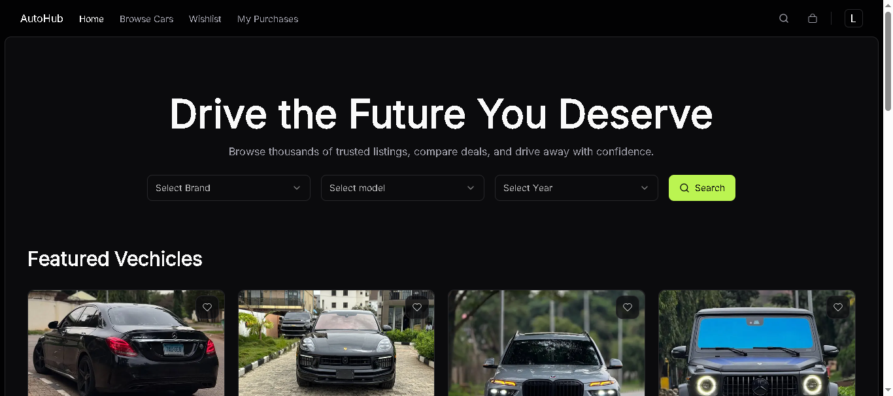
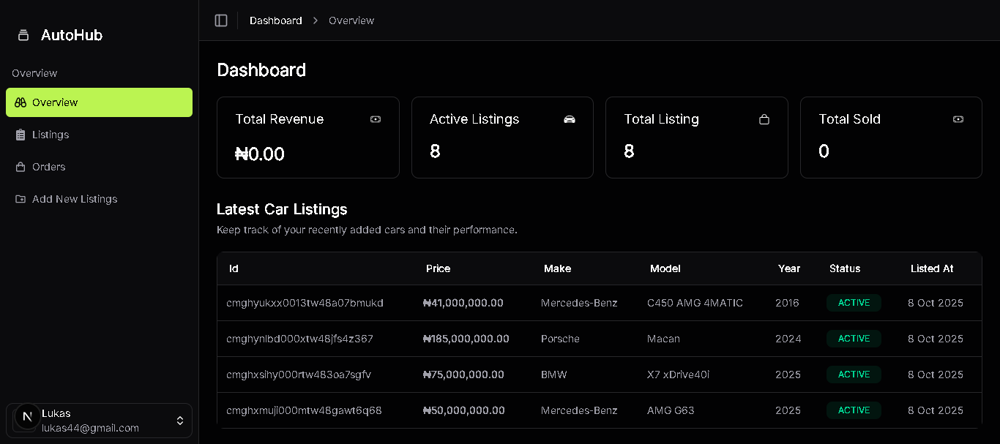

# 🚗 AutoHub

A full-stack car marketplace platform that allows users to **buy** and **sell cars** seamlessly.  
It features a **secure payment system**, **role-based dashboards**, **image uploads**, and a **modern UI** inspired by real-world marketplaces.

---

## 🧭 Overview

AutoHub is a comprehensive web application that connects car buyers and sellers on a single platform.  
It offers a secure payment system powered by **Paystack**, intuitive dashboards for **admins** and **sellers**, seamless image uploads via **UploadThing**, and a responsive interface built with **Next.js** and **Tailwind CSS**.

Whether you're a car owner looking to sell, an admin managing listings, or a buyer searching for your next ride — AutoHub provides a smooth, fast, and secure experience.

---

## ✨ Features

- 🔐 **Authentication**: Email, Google login, and password reset functionality powered by **Better Auth**
- 👥 **Role-based access control** for:
  - **Admin**: Approve/reject car listings, verify authenticity, and manage all listings
  - **Seller**: Create, update, track, or delete their listings
  - **Buyer**: Purchase cars, manage wishlist (after account creation)
- 💳 **Secure payments** with **Paystack**
- 📸 **Image uploads** powered by **UploadThing** for car listings
- 🔎 **Browse, filter, and search** for cars effortlessly
- 🧱 **Fully responsive** design with **Tailwind CSS**
- 🧩 **Type safety** with **TypeScript**
- ✅ **Schema validation** using **Zod**
- 📝 **Form validation** with **React Hook Form**
- 🎨 **Beautiful UI components** from **ShadCN UI**

---

## 🛠️ Tech Stack

| Category           | Technologies                                                              |
| ------------------ | ------------------------------------------------------------------------- |
| **Frontend**       | Next.js, React, TypeScript, Tailwind CSS, ShadCN UI, React Hook Form, Zod |
| **Backend**        | Prisma, PostgreSQL (**Neon Database**), Zod                               |
| **Authentication** | Better Auth (Login, Signup, Password Reset, Last Used Method)             |
| **Payment**        | Paystack                                                                  |
| **File Upload**    | UploadThing                                                               |
| **Deployment**     | Vercel                                                                    |

### 🧩 Badges


---

## 🖼️ Screenshots

| Homepage                          | Dashboard                              |
| --------------------------------- | -------------------------------------- |
|  |  |

---

## 🔗 Live Demo

👉 [**View Project Live**](https://auto-hub-liard.vercel.app/)

---

## 🚀 Getting Started

This project was bootstrapped with [`create-next-app`](https://nextjs.org/docs/app/api-reference/cli/create-next-app).

### 🧰 Prerequisites

Make sure you have the following installed:

- **Node.js** (>= 18)
- **npm**, **yarn**, **pnpm**, or **bun**
- **PostgreSQL** database (or use Neon)

### 🛠️ Installation

1. **Clone the repository**

   ```bash
   git clone https://github.com/DevLukman/AutoHub.git
   cd AutoHub
   ```

2. **Install dependencies**

   ```bash
   npm install
   # or
   yarn install
   # or
   pnpm install
   ```

3. **Set up environment variables**

   Create a `.env.local` file in the root directory:

   ```bash
   # Database
   DATABASE_URL="your_postgresql_connection_string"

   # Better Auth
   BETTER_AUTH_URL="http://localhost:3000"
   BETTER_AUTH_SECRET="your_secret_key_min_32_chars"
   NEXT_PUBLIC_BETTER_AUTH_URL="http://localhost:3000"

   # Google OAuth
   GOOGLE_CLIENT_ID="your_google_client_id"
   GOOGLE_CLIENT_SECRET="your_google_client_secret"

   # Paystack
   PAYSTACK_SECRET_KEY="your_paystack_secret_key"
   NEXT_PUBLIC_PAYSTACK_PUBLIC_KEY="your_paystack_public_key"

   # UploadThing
   UPLOADTHING_TOKEN="your_uploadthing_secret"


   # Email (Resend)
   RESEND_API_KEY="your_resend_api_key"
   ```

4. **Set up the database**

   ```bash
   npx prisma generate
   npx prisma db push
   ```

5. **Run the development server**

   ```bash
   npm run dev
   # or
   yarn dev
   # or
   pnpm dev
   ```

6. **Open your browser**

   Navigate to [http://localhost:3000](http://localhost:3000) to see the app in action.

---

## 📂 Project Structure

```
AutoHub/
├── app/                  # Next.js App Router pages
├── components/           # Reusable React components
├── lib/                  # Utility functions, auth config, etc.
├── prisma/              # Prisma schema and migrations
├── public/              # Static assets
├── styles/              # Global styles
└── types/               # TypeScript type definitions
```

---

## 🔑 Key Features Explained

### Authentication

- Powered by **Better Auth** with email/password and Google OAuth
- Password reset via email using **Resend**
- Tracks last used login method

### Role-Based Access

- **Admin**: Full control over listings and user management
- **Seller**: Can create and manage their own listings
- **Buyer**: Can browse, wishlist, and purchase cars

### Payments

- Secure checkout with **Paystack**
- Transaction history and receipts

### Image Management

- **UploadThing** handles all image uploads
- Multiple images per listing
- Optimized image delivery

---

## 🤝 Contributing

Contributions are welcome! Please follow these steps:

1. Fork the repository
2. Create a feature branch (`git checkout -b feature/AmazingFeature`)
3. Commit your changes (`git commit -m 'Add some AmazingFeature'`)
4. Push to the branch (`git push origin feature/AmazingFeature`)
5. Open a Pull Request

---

## 📝 License

This project is licensed under the MIT License - see the [LICENSE](LICENSE) file for details.

---

## 🙏 Acknowledgements

- 👨‍💻 Developed by [**Luqman Muhammed**](https://github.com/DevLukman)
- 🎨 Design by [**Olamide**](https://olamidee.tech)
- 🔐 [Better Auth](https://better-auth.com)
- 💳 [Paystack](https://paystack.com)
- 📸 [UploadThing](https://uploadthing.com)
- ⚛️ [React](https://react.dev)
- ▲ [Next.js](https://nextjs.org)
- 🧠 [TypeScript](https://www.typescriptlang.org)
- 🪄 [ShadCN UI](https://ui.shadcn.com)
- 🗄️ [Prisma](https://www.prisma.io)
- 🐘 [PostgreSQL](https://www.postgresql.org)

---

## 📧 Contact

For questions or feedback, reach out to:

- **Email**: muhammedluqman003@gmail.com
- **GitHub**: [@DevLukman](https://github.com/DevLukman)
- **LinkedIn**: [Your LinkedIn Profile](https://linkedin.com/in/yourprofile)

---

> 💡 _AutoHub aims to simplify the car marketplace experience through secure payments, smooth role-based workflows, and a beautiful, accessible interface._

---
